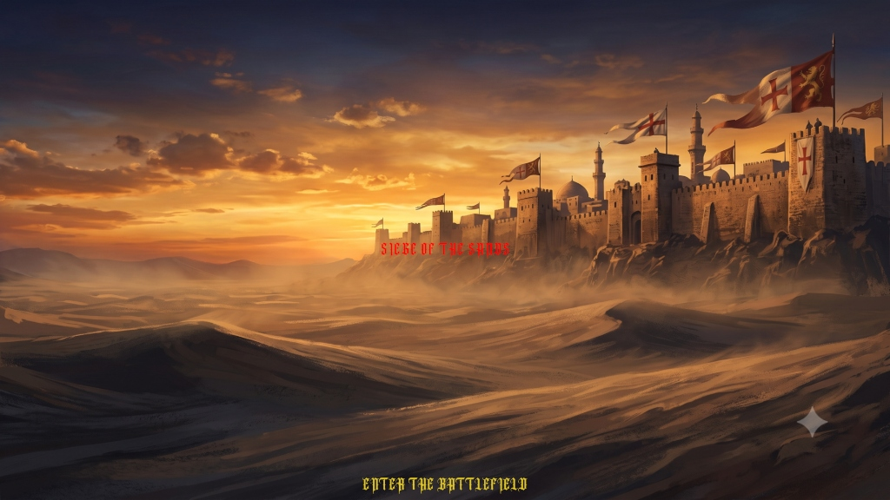
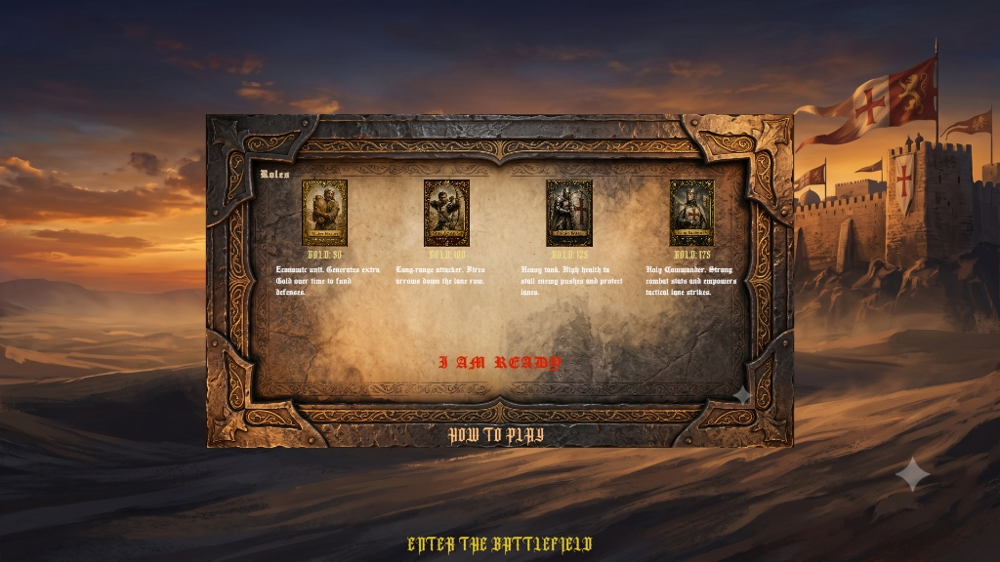
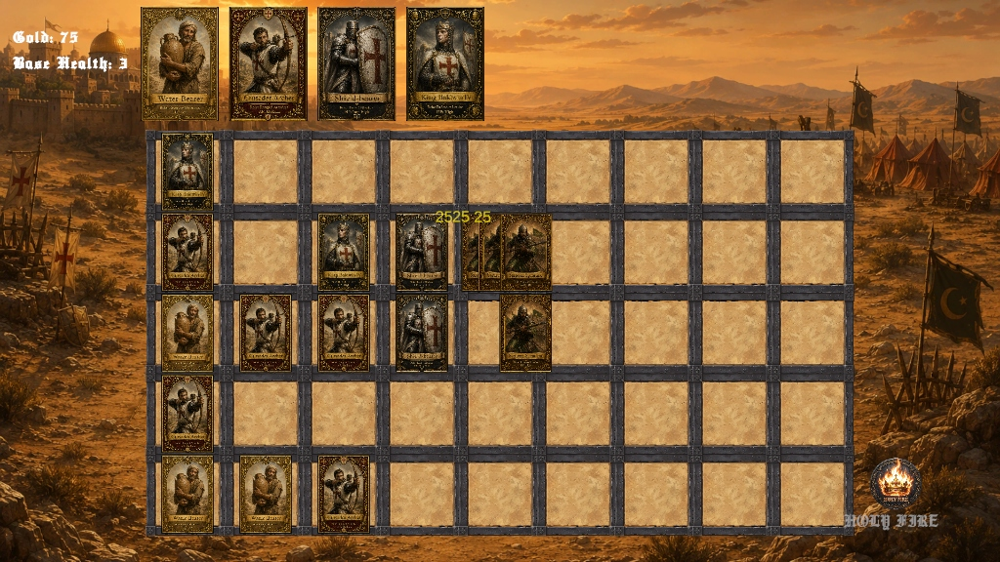
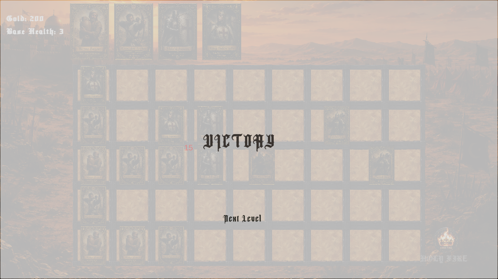
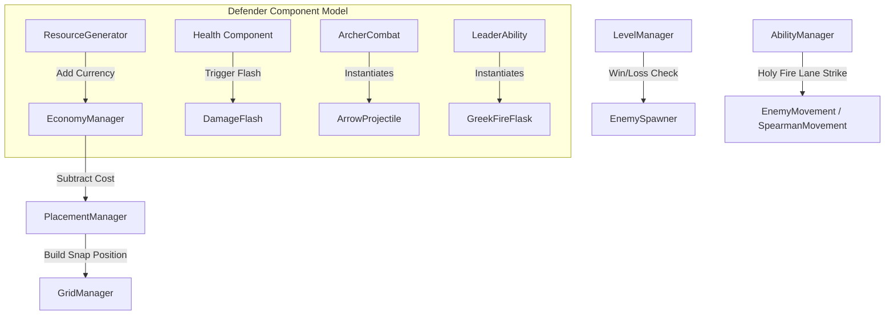

# 🏰 Siege of the Sands

**Siege of the Sands** is a 2D grid-based tactical lane-defense game built in Unity. Set in a gritty, atmospheric medieval desert during the Crusades, players must strategically deploy Crusader units to defend their fortress walls against waves of invading Saracen infantry, spearmen, and elite Mamluks.

---

## 📸 Gameplay & Visual Walkthrough

Below is a visual overview of the campaign progression:

| Scenario / Screen | Visual Preview | Description |
| :--- | :---: | :--- |
| **Main Menu Screen** |  | A cinematic introduction featuring Gothic UI elements, interactive buttons, and theme-setting medieval illustration. |
| **Faction Roles Screen** |  | The military council overview displaying unit descriptions, tactical advice, and gold costs prior to deployment. |
| **Tactical Grid Gameplay** |  | An active battle showcasing Crusader archers and shield bearers holding the lanes, passive/active gold ticks, and enemy waves. |
| **Victory Screen** |  | Successfully holding the line unlocks progression to the next siege battle. |

---

## 🛡️ Defender Compendium (Crusader Forces)

Deploy units on the battlefield grid by spending gold. The portraits are located in `Assets/_Project/Sprites/UI/`.

| Portrait | Unit Name | Core Role | Gold Cost | Max HP | Combat Mechanics & Abilities |
| :---: | :--- | :--- | :---: | :---: | :--- |
|  | **Water Bearer** | Economy | `50` | `100` | Non-combatant unit. Generates **+25 Gold** every **5.0 seconds** to fund your front-line forces. |
|  | **Crusader Archer** | Ranged DPS | `100` | `100` | Detects enemies in its lane up to **8.0 units** away. Fires arrows dealing **20 damage** every **1.5s** (approx. **13.3 DPS**). |
|  | **Shield-Bearer** | Tank | `125` | `300` | Exceptional high-health barrier. Used to stall enemy pushes and protect fragile backline shooters. Does not attack. |
|  | **King Baldwin IV** | Commander | `175` | `100` | Throws AOE **Greek Fire Flasks** every **4.0s** targeting enemies up to **6.0 units** away. Deals **50 radial damage** (1.2 unit radius). |

### 🔥 Faction Active Ability: Holy Fire
When King Baldwin IV leads your army, you can activate the **Holy Fire** lane strike:
* **Activation**: Click the Holy Fire HUD icon, then select any of the five grid lanes.
* **Cooldown**: `15.0 seconds`
* **Damage Rate**: `25 damage` per tick.
* **Duration**: `4.0 seconds` (ticks every 0.5s, inflicting a total of **200 damage** to all enemies in the target lane).

---

## 🪓 Invading Forces (Saracen Attackers)

Invaders march from the right side of the screen down random lanes. The portraits are located in `Assets/_Project/Sprites/UI/`.

| Portrait | Unit Name | Type | Max HP | Move Speed | Combat Stats | Attack Behavior |
| :---: | :--- | :--- | :---: | :---: | :---: | :--- |
|  | **Saracen Soldier** | Light Melee | `100` | `0.5` – `1.2` | `20 DMG` / `1.5s` | Marches forward; engages in direct melee combat upon colliding with any defender. |
|  | **Saracen Spearman** | Ranged Melee | `120` | `0.5` – `1.2` | `15 DMG` / `1.2s` | Stops and attacks from a distance of **1.5 units** (one full grid tile away), bypassing blockers. |
|  | **Mamluk Elite** | Heavy Attacker | `250` | `0.5` – `1.2` | `40 DMG` / `2.0s` | High-health vanguard shock unit. Deals devastating blows designed to breach heavy defenses. |
|  | **Sultan Saladin** | Faction Leader | `N/A` | `N/A` | `N/A` | The commander orchestrating the desert siege. |

---

## 🧮 Core Game Calculations & Formulas

### 1. Grid Snapping Mathematics
To place units accurately on the isometric-flat grid, raw mouse world coordinates \((x_w, y_w)\) are snapped to column and row indices:

Let:
* \(C_w = 1.0\) (Cell Width), \(C_h = 1.4\) (Cell Height)
* \(cols = 9\), \(rows = 5\)
* \(X_{offset}, Y_{offset}\) be the bottom-left coordinate calculated from the grid center offset:
  \[
  X_{start} = X_{offset} - \frac{(cols - 1) \cdot C_w}{2}
  \]
  \[
  Y_{start} = Y_{offset} - \frac{(rows - 1) \cdot C_h}{2}
  \]

The snapped grid cell indices \((g_x, g_y)\) are:
\[
g_x = \text{clamp}\left( \text{round}\left( \frac{x_w - X_{start}}{C_w} \right), 0, cols - 1 \right)
\]
\[
g_y = \text{clamp}\left( \text{round}\left( \frac{y_w - Y_{start}}{C_h} \right), 0, rows - 1 \right)
\]

The final instantiated position vector is:
\[
P_{snap} = \begin{bmatrix} X_{start} + g_x \cdot C_w \\ Y_{start} + g_y \cdot C_h \\ 0 \end{bmatrix}
\]

---

### 2. Economy Formulas
Currency is accumulated dynamically throughout gameplay:
* **Passive Gold Ticks**:
  \[
  \text{Gold}_{passive} = +10 \text{ Gold} \quad \text{every } 2.0 \text{ seconds}
  \]
* **Water Bearer Ticks**:
  \[
  \text{Gold}_{peasant} = +25 \text{ Gold} \quad \text{every } 5.0 \text{ seconds}
  \]
* **Total Resource Flow Rate** (given \(N\) deployed Water Bearers):
  \[
  \text{Gold Generation Rate} = 5.0 + 5.0 \cdot N \quad (\text{Gold / second})
  \]

---

### 3. Combat Formulas (TTK & TTL)

#### Time To Kill (TTK)
The time required for a combatant to defeat an opponent is calculated as:
\[
\text{TTK} = \frac{\text{Health of Target}}{\text{DPS}}
\]

* **Crusader Archer DPS**:
  \[
  \text{DPS}_{Archer} = \frac{\text{Damage}}{\text{Fire Rate}} = \frac{20}{1.5s} \approx 13.33 \text{ DPS}
  \]
* **Archer TTK against Saracen Soldier (100 HP)**:
  \[
  \text{TTK} = \frac{100}{13.33} = 7.5 \text{ seconds}
  \]

#### Time To Live (TTL)
The duration a defender can withstand damage from an attacker before dying:
\[
\text{TTL} = \frac{\text{Health of Defender}}{\text{Incoming Damage / Second}}
\]

* **Shield-Bearer (300 HP) holding a Mamluk Elite (40 Damage / 2.0s = 20 DPS)**:
  \[
  \text{TTL} = \frac{300}{20} = 15.0 \text{ seconds}
  \]

---

### 4. Advanced Attack Range Checks

#### King Baldwin IV's Greek Fire (AoE Blast)
The Greek Fire flask flies linearly at speed \(v = 4.0\). Upon impact, it runs a 2D physics overlap check:
\[
\text{Overlap Circle Radius } r = 1.2 \text{ units}
\]
All units carrying the `Enemy` tag inside this radius take a flat **50 damage**.

#### Spearman Distance Strike (Raycasting)
The Saracen Spearman checks for defenders in front of it using a physical raycast:
\[
\text{Raycast Distance } d = 1.5 \text{ units}
\]
If a collider with a `Health` script (excluding other enemies) is hit:
1. Spearman halts movement vector.
2. Initiates spear attack cycle (**15 Damage** / **1.2s**).

---

## 🛠️ Technical Architecture & Design Patterns

The project utilizes a modular, component-based architecture in C# to separate concerns and ensure high performance.

### Design Patterns
1. **Manager / Controller Pattern**: Centralized manager entities handle game state, audio, economy, and spawning.
2. **Component-Based Design**: Units are assembled via interchangeable components (`Health`, `DamageFlash`, combat behaviors) rather than deep inheritance trees.
3. **Failsafe Cleanups**: Self-destruction triggers clean up projectiles (`ArrowProjectile`, `GreekFireFlask`) once they exit active camera boundaries.

---

### Architecture Workflow Diagram

---

### C# Scripts Overview

* ⚙️ **`LevelManager.cs`** — Controls base lives (default: `3`), tracks victory scene triggers, and controls level progression (`Scn_Level_01`, `Scn_Level_02`, `Scn_Level_03`).
* ⚙️ **`GridManager.cs`** — Computes the column/row layout coordinates, lower center boundaries, and snaps units to tile nodes.
* ⚙️ **`PlacementManager.cs`** — Snaps unit selection to hovered tiles, calling subtraction functions in the economy script.
* ⚙️ **`EconomyManager.cs`** — Tracks active gold stash, updates HUD icons, and controls passive income rates.
* ⚙️ **`AbilityManager.cs`** — Targets lane coordinates to apply ticking damage routines representing commander strikes.
* ⚙️ **`EnemySpawner.cs`** — Uses custom Serialized `WaveConfig` data to spawn invaders across lanes at variable speeds.
* ⚔️ **`Health.cs`** — Tracks health pools, spawns floating combat text, triggers red flashes, and calls death particle effects.
* ⚔️ **`ArcherCombat.cs`** — Lane detection scanning. Instantiates arrows when targets are within range.
* ⚔️ **`LeaderAbility.cs`** — Triggers King Baldwin IV's Greek Fire flask throws.
* ⚔️ **`EnemyMovement.cs`** — Core melee attacker behavior. Marches left, registers collision, and attacks.
* ⚔️ **`SpearmanMovement.cs`** — Ranged melee attacker behavior. Employs raycasts to hit targets 1.5 units away.
* ⚔️ **`ResourceGenerator.cs`** — Periodic callback loop to add resources to the economy manager.